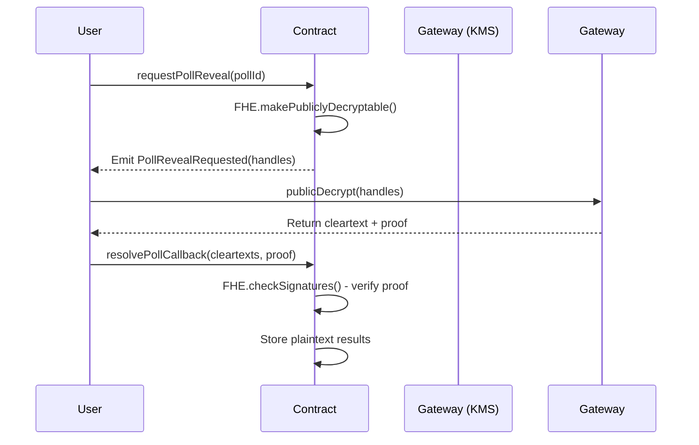

# Encrypted Polls - FHE Voting DApp

A decentralized voting application built with **Fully Homomorphic Encryption (FHE)** using Zama's FHEVM technology. This DApp enables private, secure polling where individual votes remain encrypted until they are publicly revealed through cryptographic proof verification.


## Overview

This application demonstrates the power of Fully Homomorphic Encryption (FHE) in blockchain voting systems. Users can create polls, submit encrypted votes, and reveal results through trustless public decryption with cryptographic proof verification.

### Key Features

- **🔐 Encrypted Voting**: Votes are encrypted using FHEVM (euint8) and remain private until reveal
- **📊 Multi-Option Polls**: Support for 2+ voting options per poll
- **🔓 Public Decryption**: Transparent result revelation using cryptographic proofs
- **💰 Self-Relaying Pattern**: No centralized relayer required for decryption
- **⏰ Scheduled Polls**: Set start and end times for voting periods
- **✅ One Vote Per User**: On-chain enforcement to prevent double voting

## Technology Stack

### Smart Contracts
- **FHEVM 0.9.1**: Fully Homomorphic Encryption Virtual Machine
- **Solidity 0.8.24**: Smart contract language
- **Hardhat**: Development and deployment framework


### Frontend
- **React 18**: UI framework
- **Vite**: Build tool and development server
- **TypeScript**: Type-safe development
- **ethers.js 6.9.0**: Blockchain interaction
- **Tailwind CSS**: Utility-first styling

### Network
- **Sepolia Testnet**: Ethereum test network
- **Zama Gateway**: KMS for FHE operations

## Architecture

### Smart Contract Structure

```solidity
EncryptedPolls.sol
├── Poll Management
│   ├── createPoll(question, options[], startTime, endTime)
│   ├── castVote(pollId, encryptedChoice, proof)
│   └── getPoll(pollId)
│
└── Result Decryption (Self-Relaying Pattern)
    ├── requestPollReveal(pollId) - Step 1
    └── resolvePollCallback(pollId, cleartexts, proof) - Step 2
```

### Encryption Flow

1. **Vote Submission**:
   ```
   User selects option → FHEVM SDK encrypts choice (euint8) →
   Submit encrypted vote + proof → Store on-chain
   ```

2. **Vote Storage** (On-Chain, Encrypted):
   ```solidity
   struct Vote {
       address voter;
       euint8 encryptedChoice;  // Remains encrypted
   }
   ```

3. **Result Revelation** (Public Decryption):
   ```
   Step 1: requestPollReveal() → FHE.makePubliclyDecryptable() → emit handles
   Step 2: Frontend calls publicDecrypt(handles) → Get cleartext + proof
   Step 3: resolvePollCallback(cleartexts, proof) → FHE.checkSignatures() → Store results
   ```

## Project Structure

```
vote/
├── contracts/
│   └── vote.sol                    # Main FHEVM contract (EncryptedPolls)
│
├── deploy/
│   └── deploy.ts                   # Hardhat deployment script
│
├── deployments/
│   └── EncryptedPolls.sepolia.json # Deployed contract info
│
├── frontend/
│   ├── src/
│   │   ├── App.tsx                 # Main application
│   │   ├── config/
│   │   │   ├── contracts.ts        # Contract ABI & address
│   │   │   └── fhevm.ts            # FHEVM initialization
│   │   └── services/
│   │       └── fhevm.ts            # FHEVM service (encryption/decryption)
│   │
│   ├── index.html                  # Entry point (with FHEVM CDN)
│   └── package.json
│
├── hardhat.config.ts               # Hardhat configuration
└── package.json
```

## Installation

### Prerequisites

- Node.js >= 18
- MetaMask or compatible Web3 wallet
- Sepolia ETH (for gas fees)

### Backend Setup

1. **Clone and install dependencies**:
   ```bash
   cd vote
   npm install
   ```

2. **Configure environment variables** (`.env`):
   ```env
   PRIVATE_KEY=your_private_key_here
   SEPOLIA_RPC_URL=https://sepolia.infura.io/v3/YOUR_INFURA_KEY
   ```

3. **Compile contracts**:
   ```bash
   npx hardhat compile
   ```

4. **Deploy to Sepolia**:
   ```bash
   npx hardhat deploy --network sepolia
   ```

### Frontend Setup

1. **Navigate to frontend**:
   ```bash
   cd frontend
   npm install
   ```

2. **Start development server**:
   ```bash
   npm run dev
   ```

3. **Open browser**: http://localhost:5173

## Usage

### Creating a Poll

1. Connect your wallet
2. Click "Create Poll"
3. Enter:
   - **Question**: Poll title
   - **Options**: 2 or more choices (one per line)
   - **Duration**: Voting period in minutes
4. Submit transaction

### Voting

1. Browse active polls
2. Select your choice
3. Click "Submit Vote"
4. Vote is encrypted client-side and stored on-chain
5. Each address can vote once per poll

### Revealing Results

1. Wait for poll to end (endTime reached)
2. Click "Reveal Results"
3. Frontend flow:
   - Calls `requestPollReveal(pollId)` → Contract emits handles
   - Calls `fhevm.publicDecrypt(handles)` → KMS returns cleartext + proof
   - Calls `resolvePollCallback(cleartexts, proof)` → Contract verifies and stores
4. Results become publicly visible

## FHEVM Self-Relaying Pattern

This DApp implements the **self-relaying decryption pattern**:



**Benefits**:
- No centralized relayer dependency
- Anyone can trigger decryption after poll ends
- Cryptographically verified results (KMS signatures)
- Fully trustless and transparent

## Key Implementation Details

### Tuple Encoding for Proof Verification

The contract expects decrypted values encoded as a **tuple** `(uint8, uint8, ...)` rather than an array `uint8[]`:

**Frontend Encoding**:
```typescript
const types = decryptedChoices.map(() => 'uint8'); // ['uint8', 'uint8', ...]
const encoded = abiCoder.encode(types, decryptedChoices);
```

**Contract Decoding**:
```solidity
// Extract each uint8 from tuple encoding (32-byte padded)
for (uint256 i = 0; i < voteCount; i++) {
    uint8 choice;
    assembly {
        let offset := add(abiEncodedChoices.offset, mul(i, 32))
        choice := and(calldataload(offset), 0xff)
    }
    counts[choice] += 1;
}
```

This tuple encoding matches the format expected by `FHE.checkSignatures()` for proof verification.

### Vote Privacy Model

- **Before Reveal**: Individual votes are encrypted as `euint8`, completely hidden
- **During Reveal Request**: Contract marks votes as publicly decryptable
- **After Reveal**: Vote counts are public, but individual vote-to-address mapping remains private (tallies are aggregated)

## Security Considerations

- ✅ Votes encrypted with FHEVM until reveal
- ✅ Cryptographic proof verification for decryption (KMS signatures)
- ✅ One vote per user per poll (enforced on-chain)
- ✅ Votes immutable after submission
- ✅ No admin privileges (fully decentralized)
- ⚠️ Vote-to-address linkage is not hidden (blockchain is pseudonymous)

## Gas Optimization

- Uses `euint8` for vote choices (smallest FHE type)
- Dynamic option support (2+ options) minimizes storage
- Tuple encoding reduces callback gas costs vs array encoding

## Troubleshooting

### "Failed to initialize FHEVM"
- Verify you're on Sepolia network
- Check FHEVM CDN is loading (browser console)
- Try refreshing the page

### "Poll not active"
- Ensure current time is between `startTime` and `endTime`
- Wait for poll to start if `block.timestamp < startTime`

### "Reveal not ready"
- Poll must be ended (`block.timestamp >= endTime`)
- Ensure poll has at least one vote

### "Proof verification failed"
- Frontend and contract encoding must match (tuple format)
- Ensure using correct contract ABI
- Check FHEVM SDK version compatibility

## Development

### Run Local Hardhat Network
```bash
npx hardhat node
```

### Deploy to Local Network
```bash
npx hardhat deploy --network localhost
```

### Run Frontend Against Local Network
Update `frontend/src/config/fhevm.ts` to use localhost RPC, then:
```bash
cd frontend
npm run dev
```

## License

MIT License

## Resources

- [Zama FHEVM Docs](https://docs.zama.ai/fhevm)
- [fhevmjs Documentation](https://docs.zama.ai/fhevm/references/fhevmjs)
- [Hardhat Docs](https://hardhat.org)
- [ethers.js Docs](https://docs.ethers.org)

## Contact

Built with ❤️ using Zama's FHEVM technology

---

**Note**: This DApp is deployed on Sepolia testnet for demonstration purposes. Never use real private keys or mainnet funds during testing.
